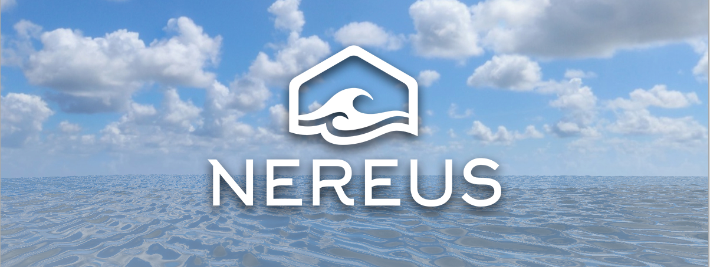

# :ocean: Nereus: A Real-time Realistic Ocean Renderer

Nereus is a modern C++ OpenGL rendering engine for rendering realistic oceans in real-time, developed as my third-year dissertation project for the University of Cambridge Computer Science Tripos. The aim was to create an open-source application that could serve as a framework and a starting point for other students, researchers or artists to explore new wave simulation techniques and water illumination models.



Contents of `README`:
  - :clipboard: [Project Description](#project-description)
    - [What is Nereus?](#What-is-Nereus?)
    - [Why was Nereus created?](#Why-was-Nereus-created?)
    - [What can you use Nereus for?](#What-can-you-use-Nereus-for?)
  - :beginner: [Usage](#beginner-usage)
    - [Getting Started](#getting-started)
    - [Interface and Controls](#interface-and-controls)
  - :camera: [Example Renders](#camera-example-renders)
  - :page_facing_up: [Dissertation](#page_facing_up-dissertation) (useful as a wiki at the moment)


## :clipboard: Project Description

### What is Nereus?

Nereus is a real-time render engine for rendering realistic oceans. That is, it is an application capable of rendering an ocean scene under real-time constraints, in which the water surface is animated with waves and has a realistic visual look. It is implemented in C++ and uses the OpenGL graphics API.

It has a flexible and modular architecture, which provides they key set-up and OpenGL components required to render an ocean scene. For example, there are separate modules for managing GLFW windowing, providing an UI and, most importantly, a rendering framework with classes encapsulating useful OpenGL constructs. 

Its clear structure allows you to focus on the key aspects of rendering ocean scenes, without having to deal with all the additional overhead of features provided by fully-fledged game engines. This makes Nereus a good starting point for anyone interested in experimenting with and developing new illumination models and wave simulation techniques. Moreover, thanks to its careful architecture design, Nereus can be easily extended to add any new features and components that you may require.

At the moment, a simple scene is provided: there is an ocean surface, a seabed beneath it and a sky skybox. A Gerstner Waves simulation has been implemented to animate the ocean surface with waves. The program also provides code for rendering the ocean surface using three illumination models: reflection of the skybox, refraction and a combination of them both using the Fresnel effect. Feel free to modify this program and extend it with your own ideas! You can find some potential ideas in the ["What can you use Nereus for?"](#What-can-you-use-Nereus-for?) section of this Readme.


### Why was Nereus created?

I developed Nereus as my third-year dissertation project for the University of Cambridge Computer Science Tripos. This involved planning, implementation and evaluation of the software, culminating in a written dissertation. 

When deciding upon a dissertation topic, I noticed that projects in the field of computer graphics with an interest in ocean rendering generally consider the following topics:
  1. Designing and creating a flexible, modular renderer architecture that can be easily extended by future users.
  2. Exploring wave simulation techniques for animating an ocean surface.
  3. Exploring different illumination models for achieving a realistic water look.

Existing projects usually look at one or two of these points in isolation, rather than all three combined. I decided to carry out a project that aimed to integrate all three goals together, producing as an end-product an open source application that could serve as a framework and a starting point for other students, researchers or artists to explore new wave simulation techniques and water illumination models. That application is Nereus.

### What can you use Nereus for?

Nereus can be an useful tool for exploring new techniques used for rendering oceans in real-time. This could include experimenting with new wave simulation techniques, or creating novel water illumination models. 

Some potential ideas—suggested as possible continuations to my dissertation project—include:
  - Implementing other wave simulations than the given Gerstner Waves one. e.g. a wave simulation based on Statistical Models and FFT calulations. It would be interesting to see how the performance and visual realism of these other wave simulation methods compare with each other and to that of the Gerstner Waves simulation. This could give further insight into how the different methods trade-off performance and visual realism, potentially pointing towards a new direction for developing a novel wave simulation method.
  - Implementing other water illumination models, or further visual effects like caustics on the seabed. This could include implementing existing, more complex water illumination models for a realistic water look, or even developing a novel model. An evaluation similar to the Visual Quality evaluation carried out in my dissertation project could be conducted, to see whether using these more complex models result in a perceivable improvement in the visual realism of the ocean scene or not.
  - Adding the possibility to add more elements to the ocean scene, by providing a flexible entity system and scene graph. As a result, the scenes rendered in Nereus could now have items floating on the water surface, or have some objects underwater, for example. This way, the scenes would be closer to what can be experienced in the real-world, rather than just considering the ocean in isolation.


## :beginner: Usage

### Getting Started

```COMING SOON```

### Interface and Controls

```COMING SOON```


## :camera: Example Renders

```COMING SOON```


## :page_facing_up: Dissertation

```COMING SOON```

